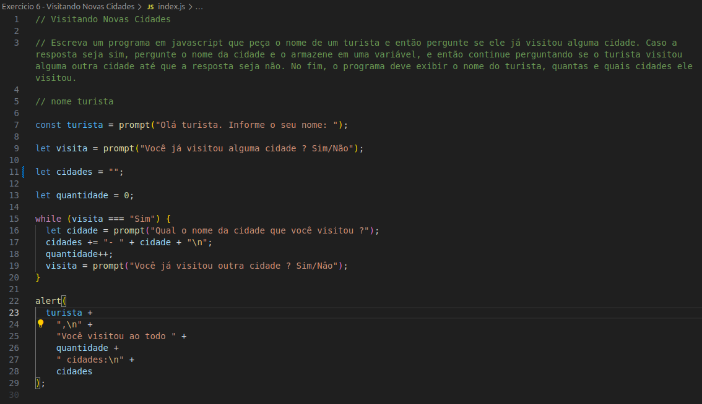

## 1. Cadastro de Recrutas

Escreva um programa em javascript que permita salvar informações de um recruta. As informações a serem salvas são:

- o primeiro nome
- o sobrenome
- o campo de estudo
- o ano de nascimento

Depois o programa deve exibir o nome completo do recruta, seu campo de estudo e sua idade (apenas baseada no ano de nascimento).

---

## 2. Calculadora de 4 Operações

Escreve um programa em javascript que permita inserir dois valores numéricos e então calcule o resultado das quatro operações básicas (soma, subtração, multiplicação e divisão).

Após calcular os resultados o programa deve exibi-los na tela.

---

## 3. Teste de Velocidade

Escreva um programa em javascript que permita inserir o nome e a velocidade de dois veículos e exiba na tela uma mensagem dizendo qual dos dois é mais rápido (ou que as velocidades são iguais se este for o caso).

---

## 4. Cálculo de Dano

Escreva um programa que permita inserir o nome e o poder de ataque de um personagem, depois o nome, a quantidade de pontos de vida, o poder de defesa de outro personagem e se ele possui um escudo, e então calcule a quantidade de dano causado baseado nas seguintes regras:

Se o poder de ataque for maior do que a defesa e o defensor não possuir um escudo, o dano causado será igual a diferença entre o ataque e a defesa.

Se o poder de ataque for maior do que a defesa e o defensor possuir um escudo, o dano causado será igual a metade da diferença entre o ataque e a defesa.

Se o poder de ataque for menor ou igual a defesa, o dano causado será 0.

Por fim, o programa deve subtrair a quantidade de dano da quantidade de pontos de vida do personagem defensor e exibir na tela a quantidade de dano e as informações atualizadas de ambos os personagens.

---

## 5 Conversor de Medidas

Escreva um programa em javascript que funcione como um conversos de medidas. O programa deverá pedir por um valor em metros e então dar a opção de escolher para qual unidade de medida esse valor deve ser convertido. As opções são:

- milímetro (mm)
- centímetro (cm)
- decímetro (dm)
- decâmetro (dam)
- hectômetro (hm)
- quilômetro (km)

O programa deve então converter a medida de acordo com a opção escolhida e exibir o resultado.

O programa também deve exibir uma mensagem de “Opção inválida” caso o usuário insira uma opção diferente das disponíveis (use o break e o default para isso)

---

## 6 Visitando Novas Cidades

Escreva um programa em javascript que peça o nome de um turista e então pergunte se ele já visitou alguma cidade. Caso a resposta seja sim, pergunte o nome da cidade e o armazene em uma variável, e então continue perguntando se o turista visitou alguma outra cidade até que a resposta seja não. No fim, o programa deve exibir o nome do turista, quantas e quais cidades ele visitou.

